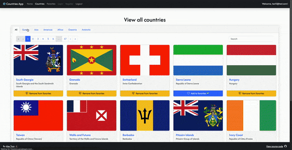
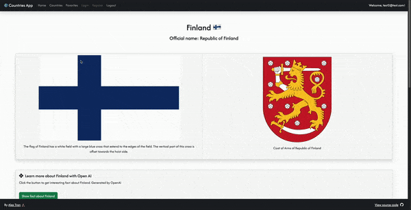

# Countries app with React and Bootstrap
A full-stack countries info app with React, Express.js and Bootstrap. The app features authentication, AI integration and databases.

After register, user can view, search for all countries, save some countries as favourites and browse various infos e.g: flags, weather, map, etc. There is AI integration powered by Open AI that gives users interesting facts when asked.

## Functions:
### Authentication
- Fast and secure login
- User info like favourites countries is store in database

### Countries page
- View all 250 countries
- Filter countries based on continent
- Search for a specific country
- Pagination for faster load time

### Favourites page
- View saved countries
- Add or remove countries from favourites

### Single country page
- View country flag, coat of arms and their description
- Ask Open AI for interesting fact about the country
- Various infos about the country
- Current weather
- A map to learn more about country geography

## Technologies used

### Language:
- Javascript

### Frameworks:
- Front-end: React with Vite
- Back-end: Express.js, Serverless
- State management: Redux, Redux Toolkit
- Styling: Bootstrap

### Libraries:
- Firebase
- Leaflet
- Openai
- Toastify

### APIs:
- Rest countries
- Open AI
- Firebase firestore
- Open weather

## Setup and usage

### Live page [here](https://countries.alextran.dev/)

### To host project locally

1. Without backend (some function will not work properly)
- Clone the project: `git clone https://github.com/alextrandev/countries_app_react_bootstrap.git`
- Change working directory `cd countries_app_react_bootstrap`
- Install dependencies `npm install`
- Add your own Firebase and OpenWeather API key to the .env file in root level in this format:
```sh
VITE_OPENWEATHER_API_KEY=your_key_here
VITE_FIREBASE_API_KEY=your_key_here
```
- Serve project in local host `npm run dev`
- Check the console for the port the project is running in

2. With backend
_Require installing Netlify localy for testing in dev environment_
- Install Netlify CLI `npm install -g netlify-cli`
- Add your own Firebase, Open Weather and OpenAI API key to the .env file in root level in this format:
```sh
OPENAI_API_KEY=your_key_here
VITE_OPENWEATHER_API_KEY=your_key_here
VITE_FIREBASE_API_KEY=your_key_here
```
- Start local Netlify dev server `npm run server`
- Check the console for the port the project is running in


## Preview
### Countries page


### Single country page


## Authors and acknowledgment

This is a learning project given by my React teacher at Business College Helsinki as part of the React Advance course

Credit to [Martin Holland](https://github.com/martin-holland) for the fantastic lessons and guidances with this project
